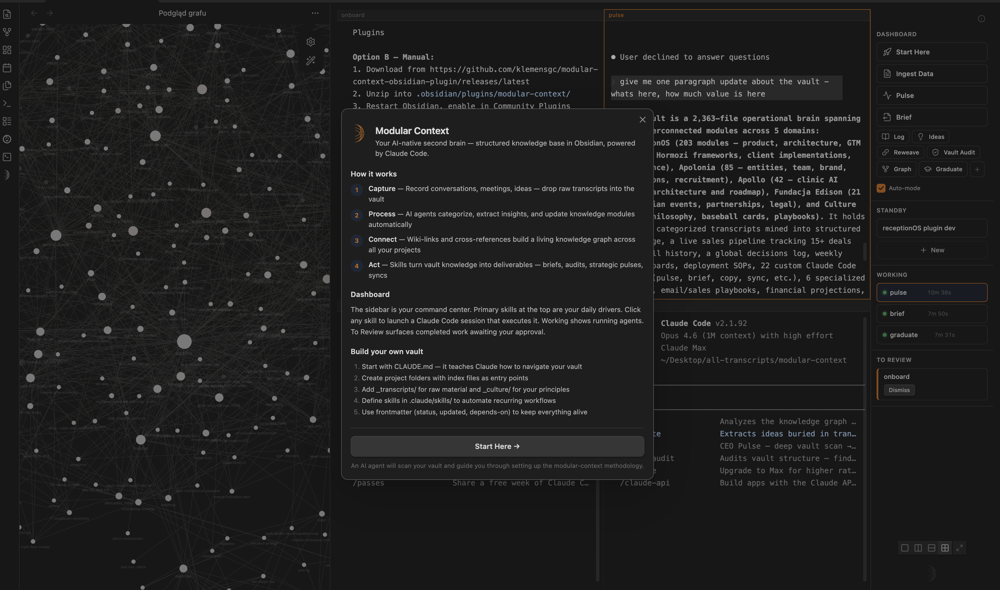

# Modular Context | Karpathy LLM Knowledge Base + Gmail & G-Cal



> *Your Obsidian vault as LLM-native knowledge base + multi-account Gmail & Calendar exposed as MCP tools for Claude Code. Local-first, encrypted, no telemetry.*


---

## What is this?

**Two things in one plugin:**

1. **LLM Knowledge Base** — Your Obsidian vault structured as Sources → Wiki → Schema (Karpathy-aligned framing). Multi-terminal Claude Code + Codex with skills sidebar, agent tracking, session glyphs. Your second brain seen by LLMs as a first-class context.

2. **G-Suite MCP Server** — Multi-account Gmail + Calendar exposed as 10 native tools for Claude Code (`gmail_search`, `gmail_send`, `calendar_freebusy`, …). OAuth 2.0 + PKCE desktop flow, tokens encrypted via Electron `safeStorage` (OS keychain), no telemetry, no cloud.

One install, one onboarding, two productivity frontiers.

---

## Architecture

```
                    🦀  LLM KNOWLEDGE BASE
                    ┌────────────────────────┐
                    │   Sources · Wiki ·     │
                    │   Schema  (vault)      │
                    └───────┬────────▲───────┘
                            │        │
                 feed every │        │ write digest /
                 new session│        │ synthesise back
                            ▼        │
           ╔═════════════════════════╧════════════════════╗
           ║     🦀  CLAUDE CODE  (sessions · terminals)  ║
           ║                                              ║
           ║     ⟲  inbox digest loop                     ║
           ║     ⟲  meeting prep loop                     ║
           ║     ⟲  synthesise-files loop                 ║
           ╚═══════════╦════════════════════╦═════════════╝
                       │                    │
                pulls  │                    │  pushes
                       ▼                    ▼
           ┌──────────────────────────────────────────┐
           │   🦀  mcp-google   (stdio · Node)        │
           └───────────┬──────────────────────┬───────┘
                       ▼                      ▼
                    🦀  GOOGLE WORKSPACE (multi-account)
                    ├─ Gmail   ✓    ← read   → send/draft/label
                    ├─ GCal    ✓    ← list   → create/update/delete
                    ├─ Docs    ⋯  coming soon
                    └─ Drive   ⋯  coming soon

        ── configured by ──▶  🦀  Modular Context Plugin
                               (infra · OAuth · sidecar)
```

**Architecture decisions** (ADRs in `_workspace/2026-04/w3/google-workspace/adrs/`):
- ADR-001 — Hybrid OAuth: Quick Connect (shared client) + BYO (user-provided client)
- ADR-002 — Electron `safeStorage` token storage (OS keychain)
- ADR-003 + addendum — MCP server stdio lifecycle + plaintext credentials sidecar
- ADR-005 — Multi-account storage model (per-account folder + index)

---

## Features

### LLM Knowledge Base

- **Multi-terminal split layouts** — single, side-by-side, stacked, 2×2, 2×3, 2×4. Up to 8 sessions.
- **Claude Code + Codex** — toggle AI provider in settings; auto-launch on new terminal.
- **Skills sidebar** — 3 primary skills (full-width), rest in secondary grid. One-click launches.
- **Agent tracker** — Working / To Review / Standby states per session.
- **Session glyphs** — unique geometric shape per terminal. Skills inherit their icon.
- **Compact mode** — 48px icon-only sidebar, maximum terminal real estate.
- **Fullscreen overlay** — terminal fills Obsidian; sidebar docks right. `Esc` to exit.
- **Real PTY** — zsh in a pseudo-terminal, not a basic runner.
- **Wiki-link autocomplete** — `[[` inside terminal searches vault notes.
- **Drag-and-drop** — Finder / Obsidian → terminal as shell-escaped paths.
- **Session persistence** — tab names, glyphs, layouts survive restarts.
- **Smart Session Restore** — on reopen, picker modal classifies saved sessions (Needs attention / Idle / Archive) instead of silent auto-resume. You choose what materializes — no accidental skill re-runs.
- **Auto-onboarding** — first install triggers a setup agent that scaffolds your vault.

### G-Suite MCP Server (v2.0 stable)

- **Multi-account** — unlimited Google accounts in parallel (Testing mode: up to 100 test users per account)
- **10 tools** for Claude Code (Gmail + Calendar — see table below)
- **Zero telemetry** — no metrics, no crash reports, no external calls beyond OAuth + Google API
- **Local-first** — tokens encrypted via OS keychain (macOS Keychain / Windows DPAPI / Linux libsecret via `libsecret`)
- **Auto-refresh** — 50-minute timer per account, 5-minute expiry buffer
- **Error taxonomy** — `TOKEN_EXPIRED`, `ACCOUNT_NOT_FOUND`, `SCOPE_OUTDATED`, `RATE_LIMITED`, `PERMISSION_DENIED`, `QUOTA_EXCEEDED`, `NETWORK_ERROR`
- **Hot reload** — server re-reads credentials per tool call, zero-downtime refresh

---

## 3 primary skills (post-onboarding)

| Skill | Purpose | Uses |
|-------|---------|------|
| **Synthesise Files** | Turn raw files (transcripts, notes, backlog) into vault modules — categorize, tag, update, reweave neighbors | Your vault, optional `_transcripts-backlog/` |
| **WhatsApp Digest** | Analyze WhatsApp groups for action items, blindspots, staleness vs vault | macOS WhatsApp.app |
| **Gmail + Calendar** | Inbox sweep, stale follow-ups, calendar gap analysis, meeting prep | MCP tools below |

All three write artifacts to `_workspace/{YYYY-MM}/w{N}/`. Secondary skills (Pulse, Brief, Log, Reweave, Graph, Graduate, Ideas, Vault-Audit) available in sidebar grid.

---

## 10 MCP tools

### Gmail (4)

| Tool | Purpose |
|------|---------|
| `gmail_search` | Query with Gmail syntax (`is:unread`, `from:X`, `after:2026-04-01`). Optional body extraction. |
| `gmail_draft` | Create draft — not sent. User opens `webUrl` in Gmail UI to send. |
| `gmail_send` | Send immediately. Skip draft for trusted, scripted sends. |
| `gmail_modify_labels` | Add/remove labels — system presets (`INBOX`, `UNREAD`, `STARRED`, `IMPORTANT`, `SPAM`, `TRASH`) + custom labels by name. |

### Calendar (6)

| Tool | Purpose |
|------|---------|
| `calendar_list_calendars` | Enumerate all calendars user has access to. |
| `calendar_list_events` | Events in time range. |
| `calendar_create_event` | Create event (`sendUpdates: "none"` default — no auto-invite spam). |
| `calendar_update_event` | Patch existing (only provided fields changed). |
| `calendar_delete_event` | Delete. |
| `calendar_freebusy` | Query busy windows across multiple calendars — ideal for "find time to meet". |

**Every tool accepts optional `account` param** (email, case-insensitive). Omit → primary account. Unknown email → `ACCOUNT_NOT_FOUND` error.

**OAuth scopes required:** `gmail.modify`, `calendar`, plus OIDC `openid email profile`.

---

## Install

### Plugin

Requires Obsidian ≥ 0.15 and macOS (Linux + Windows may work; untested).

**Via BRAT (Beta Reviewer plugin, recommended for now):**
1. Install BRAT from Community Plugins
2. `Cmd+P` → "BRAT: Add a beta plugin" → `klemensgc/modular-context-obsidian-plugin`
3. Enable in Settings → Community plugins

**Manual:**
1. Download `main.js`, `manifest.json`, `styles.css`, `mcp-server.js` from [latest release](https://github.com/klemensgc/modular-context-obsidian-plugin/releases)
2. Copy to `<vault>/.obsidian/plugins/modular-context/`
3. Enable plugin in Settings → Community plugins → Modular Context

### MCP server

**Auto-installed** on first `Google Workspace: Connect`. Plugin copies bundled binary to `~/.modular-context/mcp-google/dist/index.js` (~100 MB one-time).

---

## Repo structure

Monorepo with three packages:

```
modular-context-obsidian-plugin/
├── packages/
│   ├── plugin/        ← Obsidian plugin (main.ts, manifest, features + MCP client glue)
│   ├── mcp-google/    ← standalone MCP server (Gmail + Calendar tools, 10 tools, Node)
│   ├── shared/        ← portable types + AgentTracker + PTY helper + UI primitives
│   └── app/           ← experimental standalone Electron app (WIP, not shipped)
├── README.md          ← you are here
├── banner.png
└── package.json       ← monorepo scripts (build:shared → build:mcp-google → build:plugin)
```

- **[packages/plugin/CHANGELOG.md](packages/plugin/CHANGELOG.md)** — user-facing release notes (v1.0 → v2.0)
- **[packages/plugin/RELEASE-v2.0.0.md](packages/plugin/RELEASE-v2.0.0.md)** — v2.0 release highlights
- **[packages/mcp-google/README.md](packages/mcp-google/README.md)** — MCP server docs (10 tools, accounts, env contract)
- **[packages/mcp-google/CHANGELOG.md](packages/mcp-google/CHANGELOG.md)** — MCP server version history
- Skill library: separate repo [klemensgc/modular-context-skills](https://github.com/klemensgc/modular-context-skills) — plugin auto-syncs

---

## Connect Google Workspace (6 steps)

1. **Create GCP OAuth Client**
   - [Google Cloud Console](https://console.cloud.google.com) → new project (e.g. `modular-context-gcp`)
   - Enable APIs: Gmail API, Google Calendar API
   - OAuth consent screen → External, Testing mode → add scopes: `gmail.modify`, `calendar`, plus `openid`, `email`, `profile`
   - Add yourself as test user
   - Create credentials → OAuth 2.0 Client ID → Desktop app
   - Copy Client ID + Client Secret

2. **Fill `.env.local`** in the plugin's build folder:
   ```
   GOOGLE_OAUTH_CLIENT_ID=...
   GOOGLE_OAUTH_CLIENT_SECRET=...
   ```

3. **Rebuild** (`npm run build` in `packages/plugin`) if self-building. Pre-built release uses the shared Quick Connect client.

4. **Reload plugin** — `Cmd+P` → "Reload app without saving"

5. **Connect** — `Cmd+P` → "Google Workspace: Connect (or add account)" → browser OAuth → authorize → done

6. **Add more accounts** — "Google Workspace: Add another account" any time

The plugin writes `.mcp.json` to your vault root + per-account sidecars to `~/.modular-context/mcp-google/accounts/{filename}/`. **Restart Claude Code session** to pick up the MCP server.

---

## Plugin commands

| Command | Purpose |
|---------|---------|
| `Google Workspace: Connect (or add account)` | Launch OAuth flow for new/additional account |
| `Google Workspace: Add another account` | Alias for above — clearer intent |
| `Google Workspace: Reconnect (upgrade scopes)` | Nuke tokens, re-auth all accounts with current scope set |
| `Google Workspace: Disconnect all accounts` | Remove all credentials + `.mcp.json` entry |
| `Google Workspace: Status` | List connected accounts, expiry times, scope status |
| `Google Workspace: Show MCP server logs` | Open `~/.modular-context/mcp-google/logs/server.log` |

Plus 5+ non-Google commands for terminal / skill management. See Command Palette.

---

## Security

- **Tokens** encrypted via Electron `safeStorage` (OS keychain). Never leave disk in plaintext.
- **Credentials sidecar** for MCP server: plaintext JSON at `0600` perms in user-scope folder (comparable to `~/.aws/credentials`, `~/.config/gcloud/`). Plugin may re-encrypt in v2.1 (see ADR-003 addendum).
- **No telemetry.** No crash reports. No metrics. Zero phone-home.
- **Logs** scrub tokens, emails, subjects via regex on every line.
- **Multi-account isolation.** Each account has separate credentials; MCP server honors `account` param strictly.

Full threat model in `ADR-003-addendum-shared-state.md`.

---

## What's new in v2.0

- 3 primary skills reorganization — `Synthesise Files` (was "Ingest Data"), `WhatsApp Digest`, `Gmail + Calendar`
- New `gsuite-analysis` skill — orchestrates 10 MCP tools with 4 playbook patterns
- Graduated v1.5 / v1.6 / v1.7 beta milestones: OAuth + storage + MCP server + multi-account + full control
- OAuth scope upgrade: `gmail.modify` + `calendar` full (replaces `gmail.readonly`, `gmail.send`, `calendar.events`)
- `mcp-google-workspace` @ 1.1.0 stable (from 1.1.0-beta.1)
- New tools: `gmail_send`, `gmail_modify_labels`, `calendar_list_calendars`, `calendar_update_event`, `calendar_delete_event`, `calendar_freebusy`
- **Smart Session Restore Picker** — replaces silent auto-resume on plugin reopen. Modal classifies saved sessions into Needs attention / Idle / Archive buckets; you pick what materializes. No accidental skill re-runs, no hidden respawns.

Full list in [packages/plugin/CHANGELOG.md](packages/plugin/CHANGELOG.md).

---

## Troubleshooting

| Issue | Fix |
|-------|-----|
| Notice: "Reconnect required for {email}" | `Google Workspace: Reconnect (upgrade scopes)` — scopes changed |
| `TOKEN_EXPIRED` from MCP tool | User revoked access or refresh token rotated — `Reconnect` |
| `ACCOUNT_NOT_FOUND` | Account not connected — `Add another account` |
| MCP server not visible in Claude Code | Restart Claude Code session. `.mcp.json` loaded at session start. |
| Plugin reloaded but old behavior | Hard reload: `Cmd+P` → "Reload app without saving" (not just disable+enable) |
| Server logs empty | Normal — server only runs when Claude Code calls a tool. Not a daemon. |

---

## Contributing

Plugin: [modular-context-obsidian-plugin](https://github.com/klemensgc/modular-context-obsidian-plugin)

Skills library: [modular-context-skills](https://github.com/klemensgc/modular-context-skills) (separate repo, auto-synced)

PRs welcome. Issues welcome. No support contract, but I read everything.

---

## License

MIT © klemensgc / receptionOS
